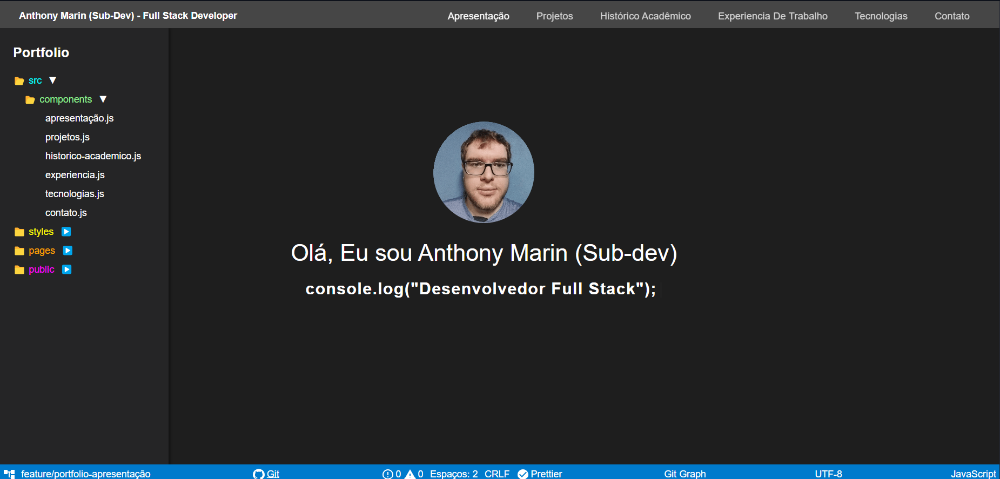
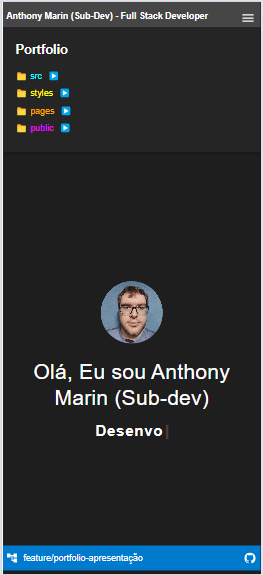
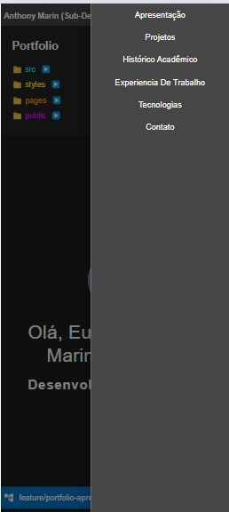

<h3 align = "center" fontSize="60px">
  Meu Portfólio Web
</h3>

<p align="center">
  <h3 align = "center" fontSize="60px">
    Portfólio DEMO
  </h3>
  
  
</p>

# Meu Portfólio Web

Este é o repositório do meu portfólio pessoal, desenvolvido em [Next.js](https://nextjs.org/), onde apresento os projetos que desenvolvi ao longo da minha trajetória como desenvolvedor web. O objetivo é demonstrar minhas habilidades técnicas e meu trabalho em uma interface moderna e responsiva.

## 🚀 Tecnologias Utilizadas

- **Next.js**: Framework React para renderização do lado do servidor (SSR) e geração de sites estáticos.
- **TypeScript**: Tipagem estática para maior segurança no desenvolvimento.
- **Material UI (MUI)**: Biblioteca de componentes React para criação de interfaces de usuário elegantes e funcionais.

## 🎨 Funcionalidades

- **Responsividade**: Totalmente responsivo, adaptado para desktop, tablets e smartphones.
- **Página de Projetos**: Uma seção dedicada aos projetos que desenvolvi, com links para repositórios GitHub e demos ao vivo.
- **Temática Visual Studio Code**: Visual moderno inspirado no editor VS Code, com paleta de cores escuras e agradável para leitura.

## 📸 Capturas de Tela

### Desktop

<p align="center">
  
</p>

### Mobile

<p align="center">
  
  
</p>

## 🛠️ Como Rodar o Projeto Localmente

1. Clone o repositório:

```bash
   git clone https://github.com/Sub-Dev/portfolio.git
```

2. Acesse o diretório do projeto:

```bash
cd portfolio
```

3. Instale as dependências:

```bash
 npm install
```

4. Rode o servidor de desenvolvimento:

```bash
 npm run dev
```

5. Abra seu navegador e acesse:

```bash
 http://localhost:3000
```

## ⚙️ Build para Produção

Para criar a build de produção:

```bash
  npm run build
```

Este comando irá gerar a versão otimizada do projeto para produção.

## 📂 Estrutura de Pastas

```bash
├── public               # Arquivos públicos, como imagens
├── src
│   ├── app              # Componentes da aplicação
│   └── components       # Componentes reutilizáveis
├── package.json         # Dependências e scripts npm
└── README.md            # Documentação do projeto
```

## 👥 Autor

<table>
 <tr>
 <td alinhar="centro">
 <a href="https://github.com/Sub-Dev" target="_blank">
 
 </a>
 </td>
 <td>
 <strong>Anthony Marin</strong> (Sub-Dev) - <a href="https://github.com/Sub-Dev">Perfil no GitHub</a>
 </td>
 </tr>
</table>

## 📝 Licença

Este projeto está licenciado sob a licença MIT. Consulte o arquivo LICENSE para mais informações.
